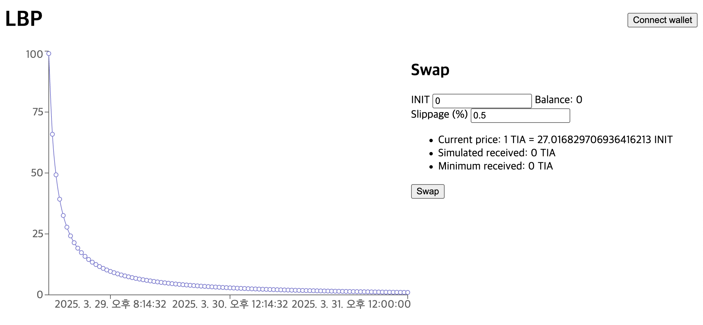

# LBP Frontend Starter

A minimal frontend starter template designed for LBP (Liquidity Bootstrapping Pool) projects. It includes basic components for displaying token charts, wallet connection, and swap transaction examples.



## 🚀 Features

- Token price chart visualization
- Wallet connect integration
- Swap transaction example
- Easily customizable for your own token and backend

## 🛠 Getting Started

This project is built with [Vite](https://vitejs.dev/).

### Clone and Run Locally

```bash
git clone https://github.com/initia-labs/lbp-starter
cd lbp-starter/frontend
pnpm install
pnpm dev
```

Open your browser and navigate to `http://localhost:5173`.

## 🔧 Customization

You need to modify the following files to suit your project. Currently, they are configured based on a specific testnet token for demonstration purposes.

### [`src/data/constants.ts`](src/data/constants.ts)

- `restUrl`: Change this to `https://rest.initia.xyz` when using the mainnet.
- **`pair`, `coinA`, `coinB`**: Replace these with the addresses generated by your backend process.  
  - You can find the required metadata using this endpoint:  
    ```
    https://rest.testnet.initia.xyz/initia/move/v1/metadata?denom=${DENOM}
    ```  
  - Use the appropriate LP pair denom (e.g., `move/xxxx`) and the denoms for coin A and B (e.g., `ubfb`, `uusdc`).  

- **`baseCoin`, `quoteCoin`**:  
  - `baseCoin` represents the asset being traded (e.g., BTC in a BTC/USDC pair).  
  - `quoteCoin` represents the asset used to price `baseCoin` (e.g., USDC in a BTC/USDC pair).  
    | `coinA`  | `coinB`  | `baseCoin` | `quoteCoin` | Action |
    |----------|----------|------------|-------------|--------|
    | `ubtc`   | `uusdc`  | `ubtc`     | `uusdc`     | Keep as is |
    | `uusdc`  | `ubtc`   | `uusdc`    | `ubtc`      | Swap values |
  - If `coinA` is the base asset and `coinB` is the quote asset, keep `baseCoin` and `quoteCoin` as they are.  
  - If `coinB` is the base asset and `coinA` is the quote asset, swap their values accordingly.  

### [`src/data/api.ts`](src/data/api.ts)

- `fetchPrices()`: Replace the mock API with the actual endpoint `/prices?limit=100` provided by your backend process. The current setup uses mock data to demonstrate functionality in an isolated environment. (After replacing it, you can delete [`src/data/example.json`](src/data/example.json).)

### [`src/main.tsx`](src/main.tsx)

- `<WalletWidgetProvider />`: If your project is going to be deployed on mainnet, remove all props assigned to this component.

### Styling/Design

This project comes with **no UI styling**, so feel free to build your own design system or integrate your preferred UI framework.
